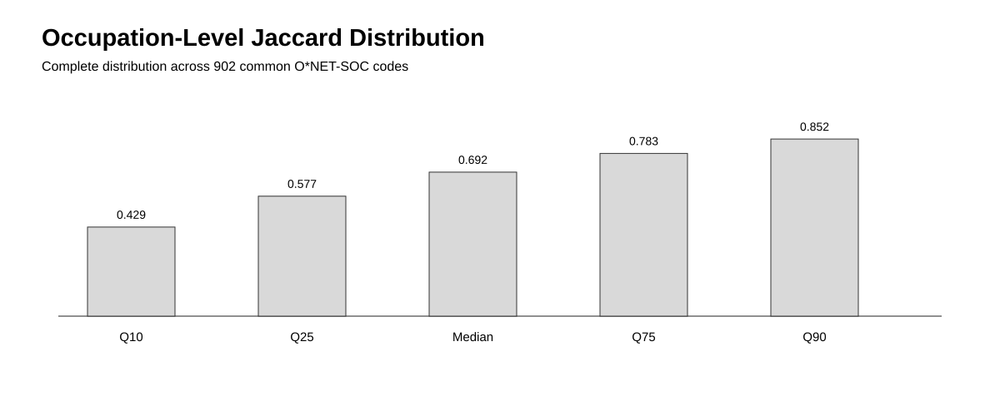

# Technology Skill Renewal Pressure: O*NET 2020–2026

[](https://github.com/devissaputra/technology_skill_renewal_pressure/actions/workflows/ci.yml)
[](https://github.com/devissaputra/technology_skill_renewal_pressure/actions/workflows/empirical-rebuild.yml)

> **Empirical Research Bundle** · **Learning & Development Research** · Workforce Skills / Software-Skill Renewal / Occupational Intelligence

Longitudinal secondary analysis of versioned O*NET software-skill portfolios, comparing O*NET 25.1 (November 2020) with the O*NET 31.0 database snapshot (August 2026).


## Research question

> How much do occupation–software-skill portfolios persist or turn over between O*NET 25.1 and O*NET 31.0, and how heterogeneous is that renewal pressure across occupations?

## Why these files are comparable

O*NET documents the longitudinal schema relationship explicitly. In release **30.3**, the file name changed from **Technology Skills** to **Software Skills**, while **Example → Workplace Example**, **Commodity Code → Element ID**, and **Commodity Title → Element Name** were renamed. The **In Demand** field was added in release 27.1.

The O*NET 31.0 data dictionary also records **30.3 as the most recent content update for Software Skills**. Therefore 31.0 is the database snapshot used here, while the software-skill content itself was most recently updated in 30.3.

To verify occupation semantics rather than assume them, this study also downloads the 25.1 and 31.0 Occupation Data files. Among the **902 occupation codes appearing in both skill files, zero titles changed**.

## Pinned sources

All four source files are downloaded from O*NET and verified byte-for-byte before analysis.

| Source | Rows | SHA-256 |
|---|---:|---|
| O*NET 25.1 Technology Skills | 29,012 | `19de2a84a52a77841f9879fd026ece1a0dc2bc5611ea306e015b74ef22d00ddc` |
| O*NET 31.0 Software Skills | 31,821 | `6aabb96b464288db849580e6510530efff3f80e25dde2bb23f1fc36bb526b016` |
| O*NET 25.1 Occupation Data | 1,016 | `63e6029d3d30ff5c7cf39b5304a733b77a409e01c65ae7095fe92f6d18d74a66` |
| O*NET 31.0 Occupation Data | 1,016 | `a09eae1d6609686e44e05b7290993a1c8b523d8ca224bc0eedc194c855c3ee02` |

Raw O*NET files are not redistributed in this repository.

## Hypotheses

1. **H1:** occupation software-skill portfolios show substantial persistence but incomplete stability.
2. **H2:** renewal pressure is heterogeneous across occupations rather than adequately represented by one portfolio-wide churn value.

These are descriptive hypotheses evaluated with versioned database evidence, not causal or inferential tests.

## Method

Software example strings are lowercased and normalized for punctuation/spacing. Exact duplicate occupation–software pairs are collapsed.

The study deliberately reports **two global comparisons**:

1. **All-release pair Jaccard** compares every unique occupation–software pair present in each release.
2. **Common-code pair Jaccard** restricts both snapshots to the **902 occupations represented in both skill files**.

Occupation-level Jaccard distributions are calculated only for those 902 common occupations.

The original source files contain duplicate rows after normalized pair construction: **83 duplicate pair rows in 2020** and **115 in 2026**. Hot Technology and In Demand counts in this release therefore refer to **unique occupation–software pairs**, not raw rows.


## Main empirical results

### Pair-set persistence

- unique occupation–software pairs, 2020: **28,929**
- unique occupation–software pairs, 2026: **31,706**
- persisted pairs across the complete releases: **24,736**
- **all-release global Jaccard: 0.6890**
- common-code pairs, 2020: **28,929**
- common-code pairs, 2026: **31,065**
- persisted common-code pairs: **24,736**
- **common-code global Jaccard: 0.7016**

The all-release value is lower because the 2026 snapshot contains software-skill pairs attached to occupation codes that are not represented in the 2020 Technology Skills file. It is not described as a statistic “across 902 occupations.”

### Occupation-level heterogeneity

Across the **902 common O*NET-SOC codes**:

- mean Jaccard: **0.6685**
- median: **0.6923**
- standard deviation: **0.1665**
- Q10: **0.4286**
- Q25: **0.5769**
- Q75: **0.7826**
- Q90: **0.8517**
- **13.97%** of occupations have Jaccard below 0.50
- **36.03%** have Jaccard at or above 0.75

The repository packages the **complete 902-row occupation table**, not only the lowest-similarity examples.



## Sensitivity analysis: broader O*NET categories

Exact software names can change because of vendor naming, product versions, or database maintenance. To test whether the renewal signal is only a string-level artifact, the analysis repeats overlap calculations using normalized **Commodity Title (25.1) → Element Name (31.0)** categories.

- common-code category-pair Jaccard: **0.8169**
- median occupation category Jaccard: **0.8481**

The higher category-level persistence indicates that some exact software-name turnover occurs within relatively stable broader software categories. The renewal signal therefore depends on the level of abstraction and should not be interpreted as pure human skill depreciation.


## Hot and In Demand attributes

After pair deduplication:

- Hot Technology unique pairs, 2020: **12,636**
- Hot Technology unique pairs, 2026: **11,456**
- In Demand unique pairs, 2026: **2,404**

The In Demand field is not used as a longitudinal 2020–2026 outcome because O*NET added that field after the 25.1 release.

## What this study can claim

The repository can describe persistence and turnover in versioned O*NET occupation–software portfolios under transparent normalization and scope rules. It can also show that renewal pressure varies substantially across occupations and that category-level overlap is higher than exact software-name overlap.

## What it cannot claim

Observed database change mixes labor-market change with taxonomy maintenance, collection updates, classification changes, software/vendor naming, and other measurement revisions. Jaccard turnover is therefore a **workforce-planning renewal-pressure indicator**, not a causal rate of human skill depreciation, obsolescence, or worker performance loss.

## Reproduce

Offline release verification:

```bash
python -m pip install -r requirements.txt
pytest -q
python run_demo.py
```

Verify the pinned sources and recompute:

```bash
python scripts/fetch_and_analyze.py
```

Regenerate the complete release:

```bash
python scripts/fetch_and_analyze.py --write
```

The empirical rebuild workflow fails if any source fingerprint changes or if regenerated evidence differs from the committed release.

## Evidence files

- `data/derived/primary_results.csv` — complete 902-occupation comparison
- `data/derived/secondary_results.csv` — ten lowest exact-name Jaccard cases for inspection
- `data/derived/robustness_results.csv` — distribution and category-sensitivity diagnostics
- `results/empirical_summary.json` — machine-readable release summary
- `data/source_manifest.json` — source URLs, row counts, release dates, and SHA-256 fingerprints
- `scripts/fetch_and_analyze.py` — complete source-to-output pipeline
- `research/model.py` — metrics, diagnostics, and release validation
- `tests/` — numerical, provenance, distribution, and evidence-consistency tests

## Licensing and attribution

Repository code and original documentation are MIT licensed. O*NET data remain subject to their source license. See [THIRD_PARTY_DATA.md](THIRD_PARTY_DATA.md) for the required O*NET / USDOL-ETA CC BY 4.0 attribution and modification notice.

## Research integrity

This is a secondary empirical analysis of public versioned data. It is **not preregistered, causal, peer reviewed, or externally validated**. The repository distinguishes source evidence, repository-derived calculations, sensitivity analysis, and interpretation.
